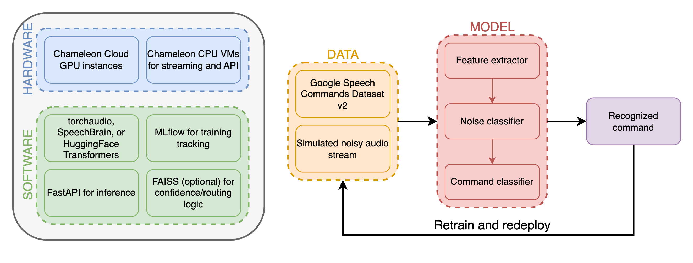

## Modular Speech Command Recognition System

<!--
Discuss: Value proposition: Your will propose a machine learning system that can be 
used in an existing business or service. (You should not propose a system in which 
a new business or service would be developed around the machine learning system.) 
Describe the value proposition for the machine learning system. What’s the (non-ML) 
status quo used in the business or service? What business metric are you going to be 
judged on? (Note that the “service” does not have to be for general users; you can 
propose a system for a science problem, for example.)
-->

### Table of Contents
1. [Value Proposition](#value-proposition)
2. [Contributors](#contributors)
3. [System Diagram](#system-diagram)
4. [Summary of Outside Materials](#summary-of-outside-materials)
5. [Summary of Infrastructure Requirements](#summary-of-infrastructure-requirements)
6. [Detailed Design Plan](#detailed-design-plan)
    - [Model Training and Training Platforms](#model-training-and-training-platforms)
    - [Model Serving and Monitoring Platforms](#model-serving-and-monitoring-platforms)
    - [Data Pipeline](#data-pipeline)
    - [Continuous X](#continuous-x)
7. [Difficulty Points Achieved](#difficulty-points-achieved)

## Value Proposition
Voice-controlled interfaces are increasingly common in smart home devices, vehicles, and industrial machinery. Most systems today rely on proprietary cloud APIs like Google Assistant or Alexa, which introduce privacy risks, internet dependency, and latency. Our system improves on this by providing a cloud-native machine learning service that enables fast, customizable, and private speech command recognition.

We train and serve models on Chameleon Cloud, exposing a speech recognition API that can be used in existing smart systems. The system supports real-time command detection and is later adaptable for edge deployment.

**Current non-ML status:** Manual control interfaces, rule-based keyword spotting, or reliance on cloud APIs.
**Business metric:** Recognition accuracy, latency per inference, system responsiveness under noise.)

### Contributors

<!-- Table of contributors and their roles. First row: define responsibilities that are shared by the team. Then each row after that is: name of contributor, their role, and in the third column you will link to their contributions. If your project involves multiple repos, you will link to their contributions in all repos here. -->

| Name                            | Responsible for              | Link to their commits in this repo |
|---------------------------------|------------------------------|------------------------------------|
| All team members                | Overall system architecture  |                                    |
| Vorrapard Kumthongdee           | Model training               | https://github.com/ho1447/ML-SysOps_Project/commits/main/?author=vorrapard |
| Iris Ho                         | Model serving and monitoring | https://github.com/ho1447/ML-SysOps_Project/commits/main/?author=ho1447 |
| Angelina Huang                  | Data pipeline                | https://github.com/ho1447/ML-SysOps_Project/commits/main/?author=phh242 |
| Jay Roy                         | Continuous X pipeline        | https://github.com/ho1447/ML-SysOps_Project/commits/main/?author=jayroy9825|

### System Diagram

<!-- Overall digram of system. Doesn't need polish, does need to show all the pieces. Must include: all the hardware, all the containers/software platforms, all the models, all the data. -->

### Summary of Outside Materials

<!-- In a table, a row for each dataset, foundation model. Name of data/model, conditions under which it was created (ideally with links/references), conditions under which it may be used. -->

|                              | How it was created                                                             | Conditions of use      |
|------------------------------|--------------------------------------------------------------------------------|------------------------|
| [Speech Commands v2](https://arxiv.org/abs/1804.03209) (3.34 GB) | Created by Google, includes 105k+ WAV clips of spoken commands                 | Free for academic use  |
| [Background noise data](https://arxiv.org/abs/1804.03209)        | Packaged with SCv2 dataset for audio augmentation                              | Free for academic use  |
| [Wav2Vec2.0](https://arxiv.org/abs/2006.11477) (95m parameters)  | Pretrained self-supervised model for audio embeddings (HuggingFace)            | Apache 2.0 License     |
| [SpeechBrain](https://github.com/speechbrain/speechbrain)                  | Open-source toolkit for speech processing (feature extraction, classification) | MIT License            |

### Summary of Infrastructure Requirements

<!-- Itemize all your anticipated requirements: What (`m1.medium` VM, `gpu_mi100`), how much/when, justification. Include compute, floating IPs, persistent storage. The table below shows an example, it is not a recommendation. -->

| Requirement     | How many/when                                     | Justification                                               |
|-----------------|---------------------------------------------------|-------------------------------------------------------------|
| `m1.medium` VMs | 3 for entire project duration                     | Run API server, monitoring, preprocessing                   |
| `gpu_mi100`     | 4 hour block twice a week                         | Train models like Wav2Vec2.0 or CNN-based classifiers       |
| Floating IPs    | 1 for entire project duration, 1 for sporadic use | Expose API externally, test in canary/staging environments  |
| Persistent Vols | 50 GB                                             | Store dataset, processed features, model artifacts and logs |

### Detailed Design Plan

<!-- In each section, you should describe (1) your strategy, (2) the relevant parts of the diagram, (3) justification for your strategy, (4) relate back to lecture material, (5) include specific numbers. -->

#### Model Training and Training Platforms

<!-- Make sure to clarify how you will satisfy the Unit 4 and Unit 5 requirements, and which optional "difficulty" points you are attempting. -->
1. **Strategy**:
   - Use a **three-part model**:
     - Feature extraction (Mel spectrograms using torchaudio)
     - Noise classification model (CNN-based)
     - Speech command classification model (MobileNetV2 or Wav2Vec2.0)
   - Train on **Google Speech Commands v2** with augmentation
   - Tune hyperparameters with **Ray Tune**

2. **Tools**:
   - Ray Train for distributed training on Chameleon Cloud
   - MLflow to track experiment runs and parameters

3. **Justification**:
   - Enables modular updates and robust performance in noisy conditions
   - Scalable training supports model reuse or extension (e.g., multi-language)

4. **Course links**:
   - **Unit 4**: Training at scale with Ray and augmentation
   - **Unit 5**: MLflow for experiment logging
   - ✅ **Difficulty point**: Ray Tune for HPO + multi-model setup

#### Model Serving and Monitoring Platforms

<!-- Make sure to clarify how you will satisfy the Unit 6 and Unit 7 requirements,  and which optional "difficulty" points you are attempting. -->
1. **Strategy**:
   - Package models into a container and expose them via a **FastAPI endpoint**
   - Perform inference using ONNX-optimized models on both GPU and CPU
   - Compare latency and concurrency behavior

2. **Monitoring**:
   - Log prediction confidence, input quality (signal-to-noise)
   - Use a dashboard to visualize misclassification trends and input stats

3. **Course links**:
   - **Unit 6**: Serving via API and edge deployment for a low resource device with latency/concurrency monitoring
   - **Unit 7**: Log-based and live monitoring of performance
   - ✅ **Difficulty point**: ONNX vs TorchScript deployment + dashboard for model degradation

#### Data Pipeline

<!-- Make sure to clarify how you will satisfy the Unit 8 requirements,  and which optional "difficulty" points you are attempting. -->
1. **Persistent storage:**
    - Object storage bucket on CHI@TACC (21.96 GB): [docker-compose-etl.yaml](/docker/docker-compose-etl.yaml)
        - speech_commands_v0.02 
        - speech_commands_v0.02_processed
        - speech_commands_v0.02_processed_mel
        - speech_commands_test_set_v0.02
        - speech_commands_test_set_v0.02_processed
        - speech_commands_test_set_v0.02_processed_mel
    - Block storage volume on KVM@TACC (50 GB): [docker-compose-block.yaml](/docker/docker-compose-block.yaml)
        - Minio
        - Postgres
        - MLflow
        - Jupyter
        - Prometheus
        - Grafana
        - Label Studio

2. **Offline data:**
    - Training dataset: speech_commands_v0.02
        - Consists of one-second .wav audio files, each containing an English word spoken by different speakers
        - Crowdsourced by Google, where participants were prompted to say a specific command such as "yes", "no", "stop", etc.
        - Also includes realistic background audio files ("doing_the_dishes.wav", "running_tap.wav") which can be mixed into training data to simulate noisy environments
        - Dataset sample
            - Speech Commands: [0a2b400e_nohash_0.wav](/data/0a2b400e_nohash_0.wav)
            - Background noise: [doing_the_dishes.wav](/data/doing_the_dishes.wav)

        <!-- Relate the data sample to the specific customer -->
        <!-- If relevant, describe what is known about a production sample over its lifetime. (example: are some features only known later? is there a natural ground truth label?) -->

3. **Data pipeline:**
    - Retrieves the data from its original source and loads it into the object store: [docker-compose-etl.yaml](/docker/docker-compose-etl.yaml)
        - extract-data
            - Downloads speech_commands_v0.02 and speech_commands_test_set_v0.02
            - Unzips speech_commands_v0.02 and speech_commands_test_set_v0.02
        - process-data
            - Normalizes the .wav audio files in speech_commands_v0.02 and speech_commands_test_set_v0.02
            - Overlays speech command audio files with background noise audio files, saving the results to:
                - speech_commands_v0.02_processed 
                - speech_commands_test_set_v0.02_processed
            - Generates mel spectrograms for the processed audio files, saving the results to:
                - speech_commands_v0.02_processed_mel
                - speech_commands_test_set_v0.02_processed_mel
        - transform-data
            - Organizes speech_commands_v0.02_processed and speech_commands_v0.02_processed_mel into directories ("training", "validation", "evaluation") according to command labels
                - Decides which set the data should belong to by taking and using a hash of the filename
                - Training:Validation:Evaluation = 8:1:1
        - load-data
            - Loads training data into the object store

4. **Online data:**
    - Sends new data to the FastAPI inference endpoint during "production" use: [online_data_pipeline.py](/workspace/online_data_pipeline.py)
        - Uses speech_commands_test_set_v0.02_processed and as "new" data
        - Shuffle the paths to the files and send to the FastAPI inference endpoint

### Continuous X

<!-- Make sure to clarify how you will satisfy the Unit 3 requirements,  and which optional "difficulty" points you are attempting. -->
1. **Strategy**:
   - Use **Terraform** and **Helm** to provision training, serving, and tracking environments on Chameleon
   - Use **Argo Workflows** to retrain and redeploy:
     - Triggered weekly or when model degradation is detected
     - Auto-promote from staging → canary → production if validation passes

2. **CI/CD**:
   - GitHub Actions for building containers, testing, and pushing to registry

3. **Course links**:
   - **Unit 3**: Full CI/CD setup with infrastructure as code
   - Immutable container deployments, no ClickOps involved

### Difficulty Points Achieved
We have satisfied **4 difficulty points** across different units in our project proposal, ensuring our approach is robust, scalable, and aligned with the requirements.

